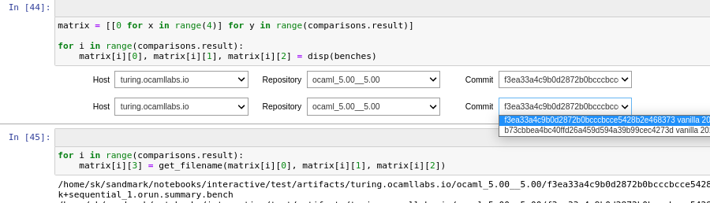

# Sandmark Notebooks

These notebooks are used to visualize the results from the
benchmarking runs.

## Requirements

You'll need to install `python3` with `jupyter`, and the following
dependency packages:

* seaborn
* pandas
* nested_dict
* papermill

If you are using JupyterHub then you can install the packages using
`pip` inside the JupyterHub terminal:

```bash
$ sudo -E pip install pandas seaborn nested_dict papermill
```

## Run

You can start the notebook using the following command:

```bash
$ jupyter notebook
```

## Sequential

The `sequential-interactive.ipynb` notebook can be invoked
interactively in the GUI or from the command-line.

### GUI

If you are running the notebook from the GUI, ensure that you set the
`artifacts_dir` to point to the correct location of the artifacts/
folder.

As you execute the cells in the notebook, you will be presented with
an option to select the number of bench comparisons, the individual
bench files and a baseline variant for comparison as shown below:




### Command-line

The notebook can be executed through the command-line using
`papermill` as shown below:

```bash
$ papermill sequential-interactive.ipynb sequential-interactive-output.ipynb -f parameters.yaml
```

A sample parameters.yaml file is provided below for reference:

```
enable_gui: False
artifacts_dir: ./test/artifacts/
selected_benches:
  - [ turing.ocamllabs.io, ocaml_5.00__5.00, b73cbbea4bc40ffd26a459d594a39b99cec4273d vanilla 20220228_010330 5.00+stable+sequential_1.orun.summary.bench ]
  - [ turing.ocamllabs.io, ocaml_5.00__5.00, f3ea33a4c9b0d2872b0bcccbcce5428b2e468373 vanilla 20220223_010015 5.00+trunk+sequential_1.orun.summary.bench ]
selected_baseline: 5.0.0
```

Since, we are running the notebook through the CLI, the `enable_gui`
variable should be set to `False`.

The `artifacts_dir` should be set correctly and must include the
`artifacts` folder.

The list of bench files for comparison are to be provided in an array
that uses the following syntax and semantics:

```
- [HOST, REPOSITORY, COMMIT VARIANT TIMESTAMP BENCH]
```

You can specify a baseline variant in the `selected_baseline`
variable.

A sample test/artifacts/ folder with bench files is available that you
you can try to execute using papermill.
